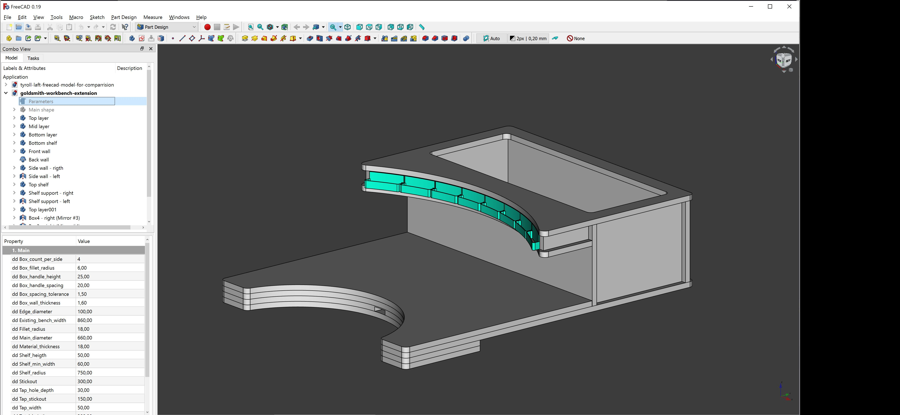
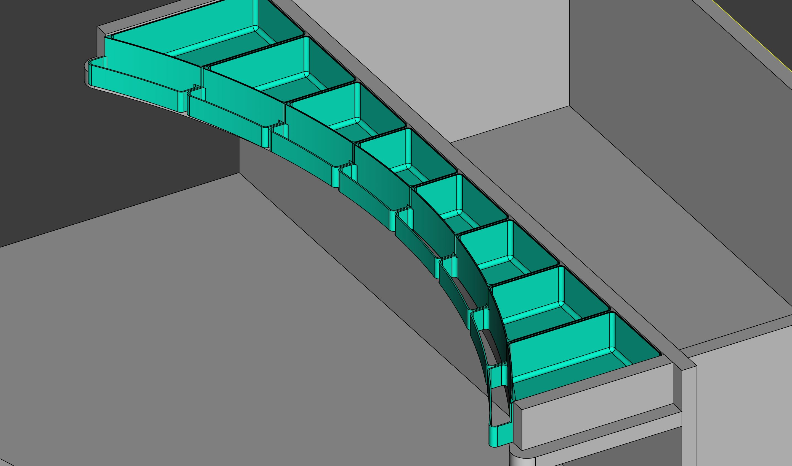
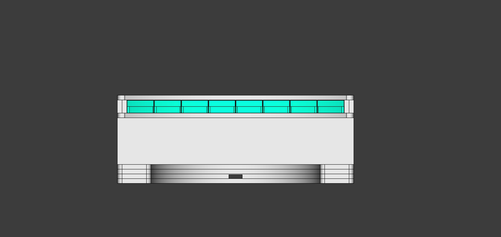
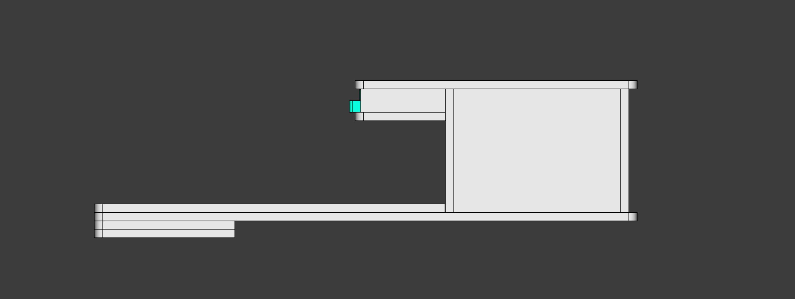
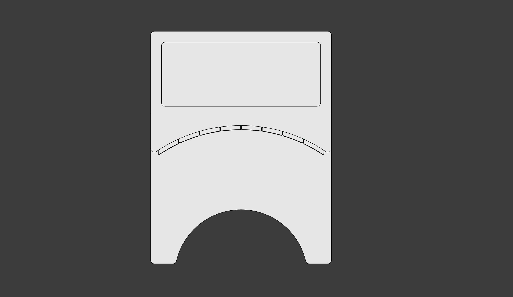

# Goldsmith workbench extension
*by Jens Dyvik, November 2021*

Add-on for converting a workbench or table into a goldsmith workbench. Designed to be CNC milled, with the small drawers to be 3D printed.

***

The files have been made with Freecad, free open design software. You can download Freecad [here](https://www.freecadweb.org/) to edit the parameters of the file, study or reuse.

### Files

 - [Main design file](https://github.com/JensDyvik/goldsmith-workbench-extension/blob/main/goldsmith-workbench-extension.FCStd)
 - CNC files, not yet finished
 - Drawer [3D print files](), mirror the files for the other side
 
### Images

*The model is parametric and designed in Freecad*

*Drawer detail with the top plate hidden*

*Front view*

*Side view*

*Top view*